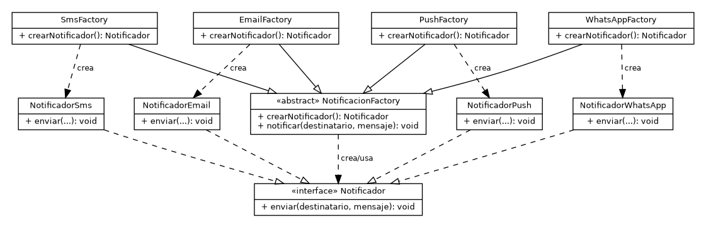
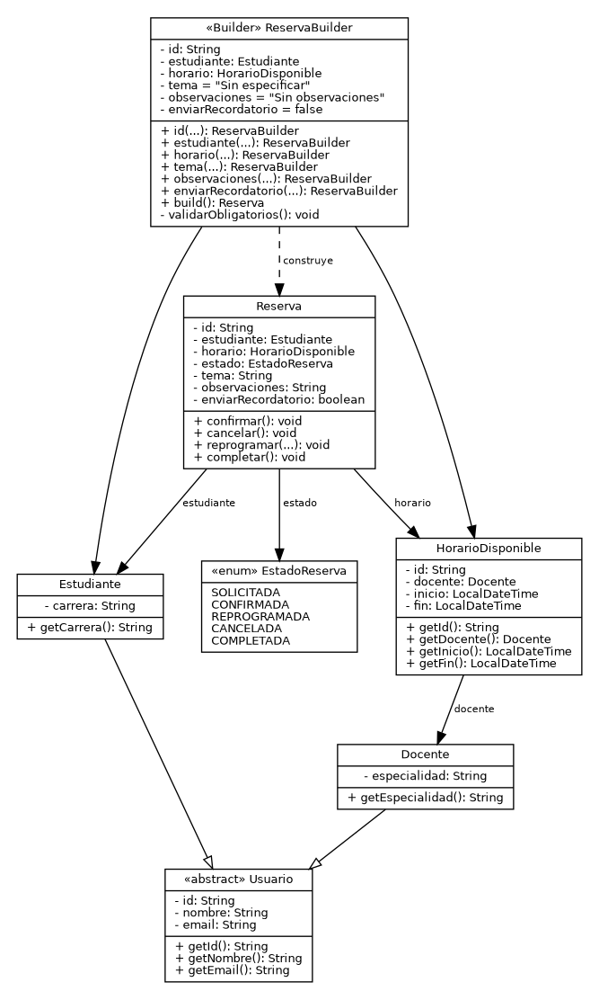

# Ae2 - Implementación comparativa de patrones de diseño

**Asignatura:** Diseño de Software - UCOM0310  
**Estudiante:** Erick Gamarra  
**Caso:** Sistema de gestión de tutorías  
**Patrones:** Factory Method y Builder  
**Java:** 17  
**Build:** Maven

## 1. Propósito

Este proyecto evoluciona el Sistema de gestión de tutorías desarrollado en Ae1. La versión anterior ya separaba las responsabilidades del dominio y utilizaba la abstracción `Notificador`. En Ae2 se aplican dos patrones creacionales sobre problemas concretos:

- **Factory Method:** desacoplar la creación de distintos mecanismos de notificación.
- **Builder:** construir objetos `Reserva` que contienen datos obligatorios y opcionales sin utilizar constructores extensos y poco legibles.

## 2. Factory Method

### Problema inicial

Si el código cliente instancia directamente `NotificadorEmail`, `NotificadorSms` o cualquier otra implementación, cada nuevo canal obliga a modificar el lugar donde se decide qué clase concreta crear. Esto aumenta el acoplamiento entre el caso de uso y los tipos concretos.

### Solución aplicada

Se define `Notificador` como **Product** y cuatro implementaciones concretas:

- `NotificadorEmail`
- `NotificadorSms`
- `NotificadorWhatsApp`
- `NotificadorPush` - variante adicional para demostrar extensibilidad

`NotificacionFactory` actúa como **Creator** y declara el Factory Method `crearNotificador()`. Las clases `EmailFactory`, `SmsFactory`, `WhatsAppFactory` y `PushFactory` deciden qué producto concreto crear.

Al incorporar Push solo se agregan `NotificadorPush` y `PushFactory`. El contrato `Notificador`, `NotificacionFactory` y las variantes existentes permanecen estables.

## 3. Builder

### Problema inicial

A medida que `Reserva` incorpora más información, un constructor como el siguiente resulta difícil de leer y mantener:

```java
new Reserva(id, estudiante, horario, estado, tema, observaciones, enviarRecordatorio);
```

Además, varios parámetros son opcionales y los argumentos pueden confundirse con facilidad.

### Solución aplicada

`ReservaBuilder` permite construir una reserva progresivamente mediante una **Fluent API**.

Campos obligatorios:

- `id`
- `estudiante`
- `horario`

Campos opcionales y valores por defecto:

- `tema = "Sin especificar"`
- `observaciones = "Sin observaciones"`
- `enviarRecordatorio = false`
- `estado = SOLICITADA` al construir

Antes de crear el objeto, `build()` valida los campos obligatorios.

Ejemplo mínimo:

```java
Reserva reservaBasica = new ReservaBuilder()
        .id("R-001")
        .estudiante(estudiante)
        .horario(horario)
        .build();
```

Ejemplo completo:

```java
Reserva reservaCompleta = new ReservaBuilder()
        .id("R-002")
        .estudiante(estudiante)
        .horario(horario)
        .tema("Aplicación de patrones de diseño")
        .observaciones("Revisar Factory Method y Builder")
        .enviarRecordatorio(true)
        .build();
```

## 4. Comparación técnica

| Criterio | Factory Method | Builder |
|---|---|---|
| Problema que resuelve | Desacopla la creación de variantes concretas. | Evita constructores extensos y permite construir objetos progresivamente. |
| Variabilidad principal | Tipo concreto de `Notificador`. | Configuración interna de `Reserva`. |
| Participantes | Product, ConcreteProducts, Creator y ConcreteCreators. | Product (`Reserva`) y Builder (`ReservaBuilder`). |
| Ventaja principal | Agregar nuevos canales sin alterar las variantes existentes. | Construcción legible, validada y con parámetros opcionales. |
| Costo / consecuencia | Aumenta el número de clases. | Incorpora una clase adicional para la construcción. |
| Cuándo utilizarlo | Cuando existen varias implementaciones de un contrato y la creación puede variar. | Cuando un objeto tiene varios datos obligatorios/opcionales o combinaciones de configuración. |
| Cuándo evitarlo | Cuando solo existe un tipo concreto y no se espera variación. | Cuando el objeto es simple y su constructor ya es claro. |

## 5. Estructura

```text
semana3-patrones/
├── README.md
├── pom.xml
├── docs/
│   ├── factory-method.puml
│   ├── factory-method.png
│   ├── builder.puml
│   └── builder.png
└── src/
    └── main/
        └── java/
            └── edu/uees/patrones/
                ├── App.java
                ├── factory/
                └── builder/
```

## 6. UML

### Factory Method



### Builder



## 7. Requisitos y ejecución

Requisitos:

- JDK 17 o superior
- Maven 3.8 o superior
- Git

Comprobar instalaciones:

```bash
java -version
mvn -version
git --version
```

Compilar:

```bash
mvn clean compile
```

Ejecutar la demostración:

```bash
java -cp target/classes edu.uees.patrones.App
```

También puede ejecutarse:

```bash
mvn clean test
```

## 8. Decisiones de diseño

1. Se conserva la abstracción conceptual `Notificador` de Ae1 para mantener bajo acoplamiento.
2. Factory Method se aplica únicamente a la creación de notificadores, no a reglas del dominio.
3. `NotificacionFactory` posee una operación común `notificar()` que trabaja con `Notificador`, mientras cada subclase redefine únicamente `crearNotificador()`.
4. `ReservaBuilder` concentra la configuración y validación necesaria para construir una `Reserva`.
5. `Reserva` mantiene las reglas de transición de estado, por lo que Builder no absorbe responsabilidades del dominio.
6. El estado inicial se fija en `SOLICITADA`, manteniendo la regla definida en Ae1.

## 9. Principios de diseño relacionados

- **OCP:** una nueva variante de notificación puede añadirse mediante un nuevo Product y ConcreteCreator sin modificar las variantes existentes.
- **DIP:** el comportamiento común del Creator trabaja con el contrato `Notificador`, no con una implementación concreta.
- **SRP:** cada notificador representa un canal, las fábricas se ocupan de la creación y `ReservaBuilder` se ocupa de la construcción de `Reserva`.

## 10. Repositorio GitHub

Repositorio previsto:

**https://github.com/erickgamarra-collab/semana3-patrones**

El repositorio debe crearse con ese nombre y luego publicarse para que el enlace sea funcional.

## 11. Historial de commits recomendado

```text
feat: crear contrato de notificacion
feat: implementar factory method
feat: agregar nueva variante de notificacion
feat: implementar reserva builder
docs: agregar diagramas UML
docs: documentar comparacion de patrones
```

Las instrucciones exactas para construir este historial en Windows se incluyen en `GUIA_GIT_WINDOWS.md`.

## 12. Declaración de uso de IA

Para esta actividad utilicé herramientas de inteligencia artificial como apoyo para organizar el análisis, proponer una estructura inicial de los patrones, revisar la coherencia entre UML y Java y mejorar la redacción de la documentación. Revisé, probé y adapté el contenido generado, y puedo explicar y justificar el código y las decisiones presentadas.
